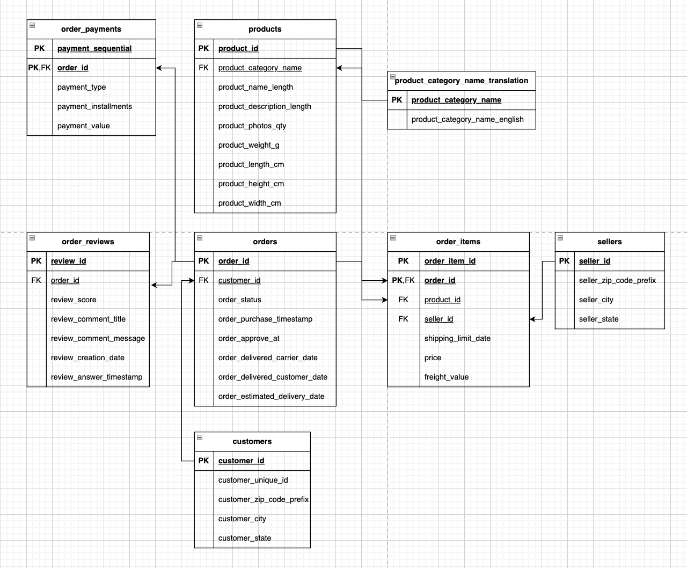
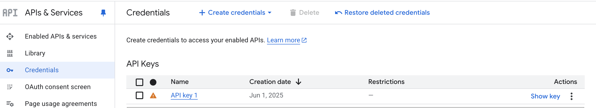
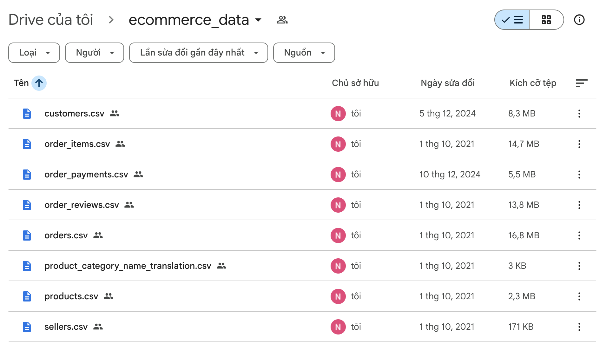
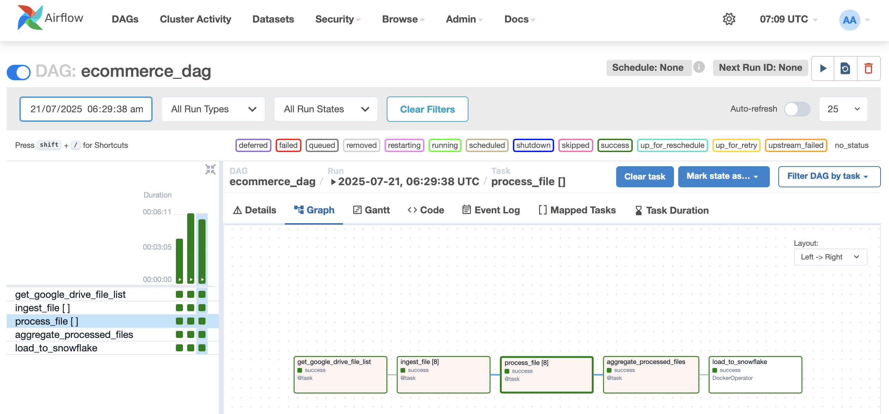
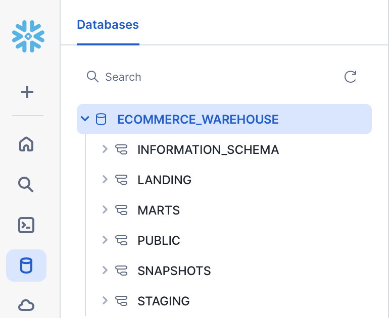
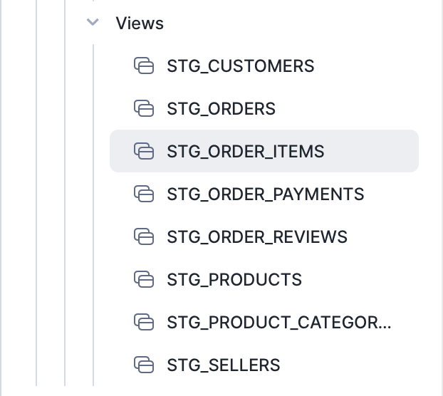
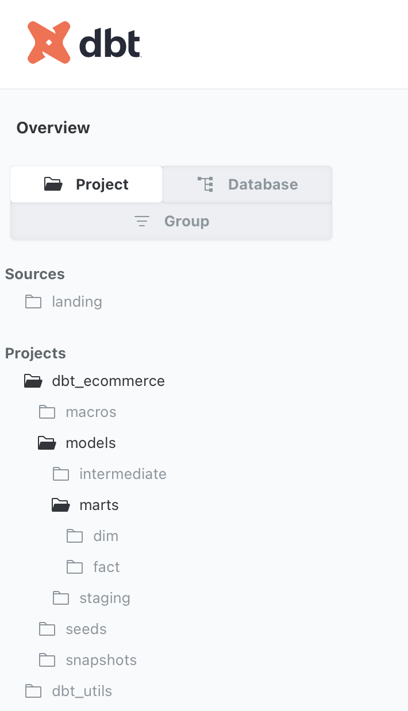
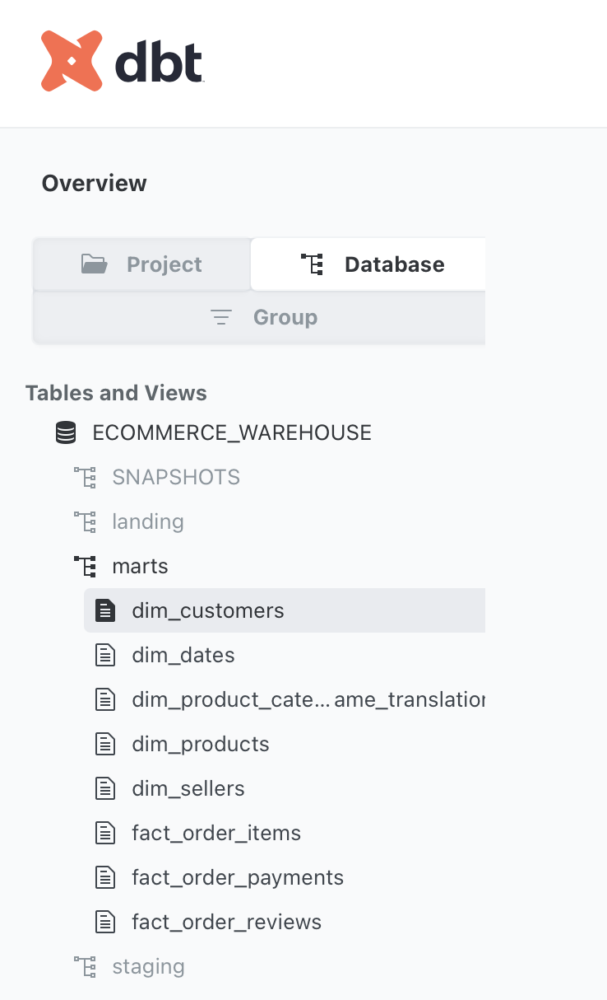

# Ecommerce Data Pipeline
A production-grade ETL data pipeline for ecommerce platforms, using Airflow, Snowflake, dbt, and Power BI.  This project automates the ingestion, transformation, validation, and reporting of sales and payment data from OLTP sources.

## Table of Contents
- [Ecommerce Data Pipeline](#ecommerce-data-pipeline)
  - [Table of Contents](#table-of-contents)
  - [Architecture](#architecture)
  - [Project Structure](#project-structure)
  - [Data Source](#data-source)
  - [Quickstart](#quickstart)
    - [Clone the repository](#clone-the-repository)
    - [Setup virtual environment](#setup-virtual-environment)
    - [Start services](#start-services)
  - [Tech Stack](#tech-stack)
    - [Apache Airflow](#apache-airflow)
    - [Amazon S3](#amazon-s3)
    - [DuckDB](#duckdb)
    - [Snowflake](#snowflake)
    - [dbt \& Great Expectations](#dbt--great-expectations)
    - [PowerBI](#powerbi)
  - [Business Insights](#business-insights)
    - [Ecommerce Overview](#ecommerce-overview)
    - [Recommendations](#recommendations)

## Architecture

<!-- Add a diagram if available -->
<p align="center">
    
    </br>
  Project Architecture
</p>

## Project Structure
```shell
.
├── airflow/                /* Airflow folder, contains DAGs and scripts */
├── assets/                 /* Assets folder, contains diagrams, dashboards, etc. */
├── dbt_ecommerce/            /* dbt project folder, contains dbt models */
├── docker/                 /* Docker services configuration folder */
│   ├── airflow/               /* Airflow orchestrator configurations */
│   ├── spark-app              /* Spark container for transformation logic */
│   ├── spark-master           /* Spark container for distributing workloads */
│   ├── spark-worker           /* Spark container for code execution */
├── .gitignore
├── .python-version
├── uv.lock
├── README.md
├── snowflake-setup.md      /* Instructions to setup Snowflake beforehand */
├── pyproject.toml          /* Project dependencies, run uv sync in virtual environment */
├── docker-compose.yaml     /* Docker Compose file to define services */
```

## Data Source

The ecommerce datasets include sales and payments information. These are typically exported from the OLTP system of an ecommerce platform and ingested into the pipeline for processing and analytics.

<p align="center">
    
    </br>
  Source Relational Model
</p>

## Quickstart

> **Prerequisites:**
> - **Git** for version control.
> - **uv** or **Conda/Mamba** for virtual environment management.
> - **Docker** for containerization.

### Clone the repository
```shell
git clone https://github.com/PhoenixPhungNguyen/ecommerce-data-pipeline.git
```

### Setting up virtual environment and dependencies

- Create and activate virtual environment:
  ```shell
  uv venv --python 3.11
  source .venv/bin/activate   # or .venv/Scripts/activate on Windows
  ```
- Initialize project and install packages:
  ```shell
  uv init
  uv add dbt-core dbt_snowflake ipykernel duckdb boto3 pyspark==3.3.0 pymupdf apache-airflow
  uv sync
  ```
### Start services

- Create a `.env` file at the root level for environment variables (see `.env.example`).
- Ensure any required data files are placed in the appropriate folders as described in the documentation.
- Make sure to add .env, .venv/, and other sensitive files to .gitignore.
- Configuring environment variables: Copy .env.example to .env and fill in:
  Google API Key and Google drive folder ID
  Slack tokens
  AWS access keys
  Snowflake credentials

To start all services:
```shell
docker compose up -d --build
```

## Tech Stack
### Google Cloud Platform (GCP)
Create API key in API & Services.
<p align="center">
    
    </br>
</p>
Share ecommerce_data folder which contains 8 CSV files to ingest data from this folder to Amazon S3
<p align="center">
    
    </br>
</p>

### Apache Airflow
Orchestrates ETL workflows for ecommerce data processing.
<p align="center">
    
    </br>
  Airflow overview
</p>

- Building and running Airflow with Docker
```shell
cd docker/spark-app
docker build . -t spark-app
cd ../../
docker compose up -d --build
```

- Install providers:
```shell
uv pip install apache-airflow-providers-slack httpfs
```

- Setup connections in Airflow UI for Slack, Snowflake, and AWS.
<p align="center">
    
    </br>
  Airflow connection overview
</p>

### DuckDB
Used for lightweight data transformation and analytics at the data lake layer.

### Amazon S3
Data Lake
<p align="center">
    
    </br>
  Amazon S3 overview
</p>
Raw folder
<p align="center">
    
    
    </br>
</p>
Processed folder
<p align="center">
    
    
    </br>
</p>

### Slack
Slack integration is used to receive real-time notifications on Airflow DAG failures and successes.  
<p align="center">
    
    </br>
</p>

### Snowflake
Data Warehouse
<p align="center">
    
    </br>
  Snowflake overview
</p>
Snowflake setup
Follow instructions in snowflake-setup.md

<p align="center">
    
    
    
    </br>
</p>

### dbt & Great Expectations
dbt (Data Build Tool) is used to transform raw data into analytics-ready, modeled datasets, manage version control, automate SQL queries, and generate documentation. 
Great Expectations complements dbt by automating data quality checks, generating detailed reports, and integrating seamlessly for end-to-end validation.

Setup & Run dbt
Configure ~/.dbt/profiles.yml with your Snowflake account details
dbt commands: 
```shell
uv pip install dbt-core dbt-duckdb
```
cd ecommerce_dbt
```shell
dbt debug       /* Check configuration */ 
dbt deps        /* Download dependent packages (if any) */  
dbt seed        /* Load CSV seed data into DuckDB */ 
dbt compile     /* Compile SQL models without running them */ 
dbt run         /* Run all models to build tables/views */ 
dbt snapshot    /* Execute snapshots to capture state changes over time */ 
dbt test        /* Run data tests to validate data quality */ 
```

Generate and serve documentation for your dbt models and data quality checks:
``shell
dbt docs generate
dbt docs serve
```

View lineage graphs of your transformations to understand dependencies:
<p align="center">
    
    </br>
  dbt overview
</p>
<p align="center">
    
    
    </br>
</p>


### PowerBI
For dashboarding and visualization of ecommerce analytics.
<p align="center">
    
    </br>
  PowerBI overview
</p>

## Business Insights

Once the pipeline is operational, you can generate insights such as:

### Ecommerce Overview
- Revenue trends by month and product category
- Payment delays by payment method or region
- Conversion rate by traffic source (optional)

### Recommendations
- Improve warehouse restocking strategy based on sales forecast
- Optimize promotions based on high-performing SKUs
- Identify abandoned cart patterns and take corrective actions

