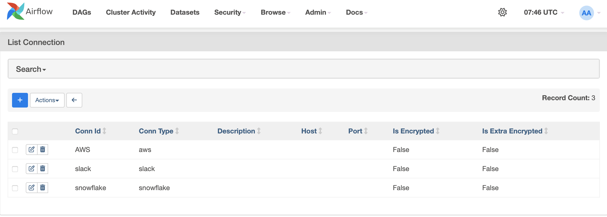
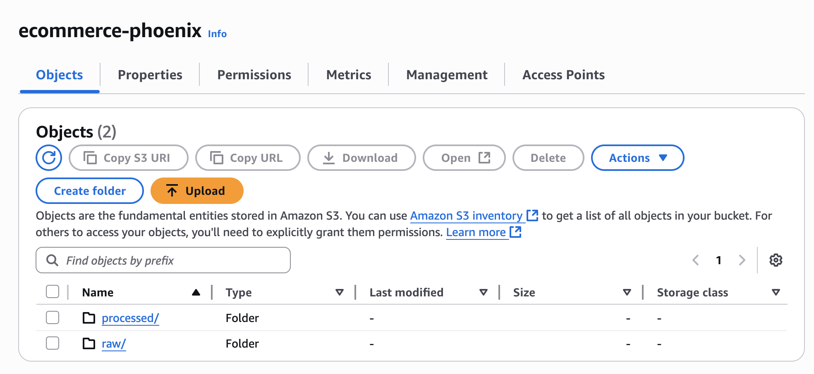
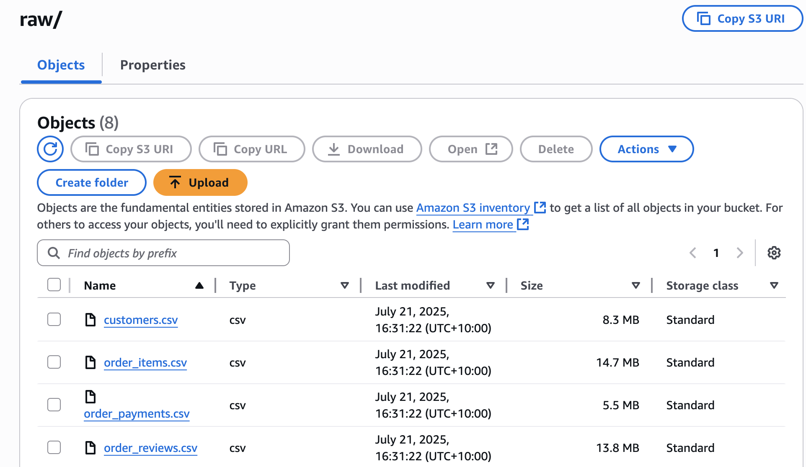
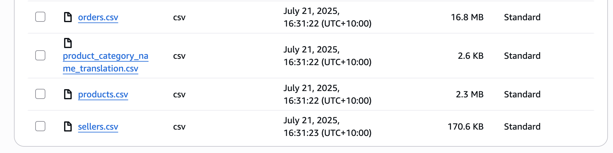
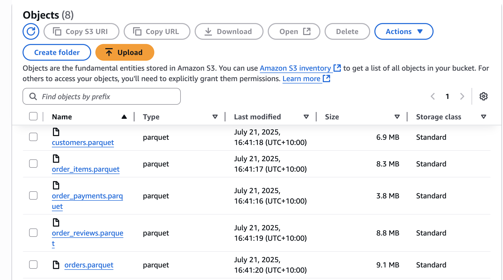
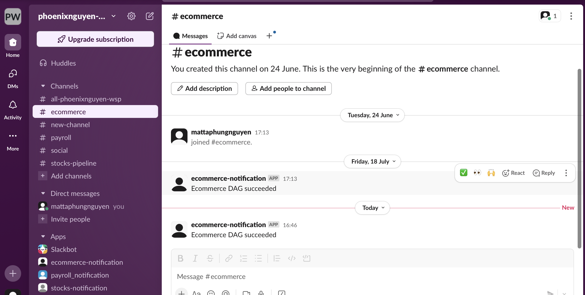
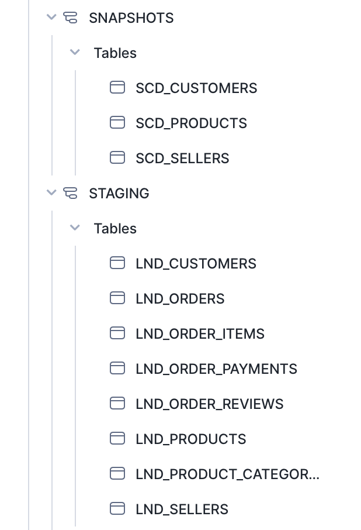
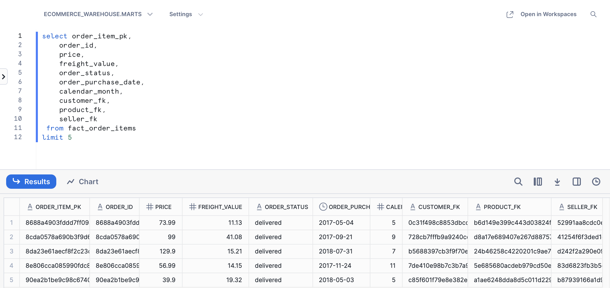
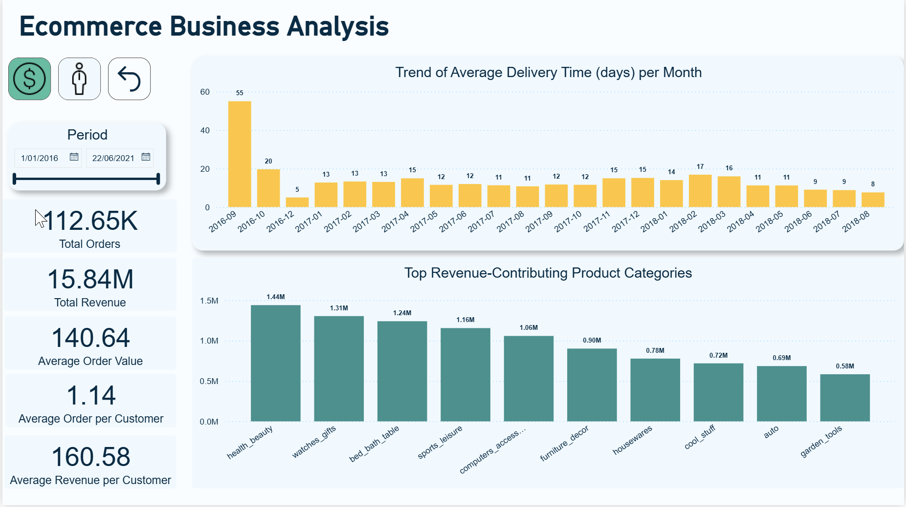
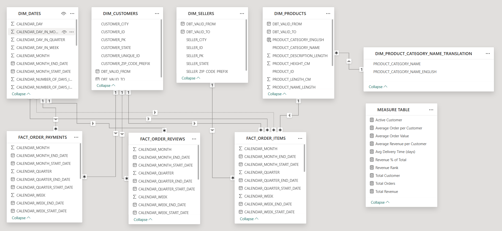

# Ecommerce Data Pipeline
A production-grade ETL data pipeline for ecommerce data, using Airflow, Snowflake, dbt, and Power BI.  This project automates the ingestion, transformation, validation, and reporting of sales and payment data from OLTP sources.

## Table of Contents
- [Architecture](#architecture)
- [Why This Architecture?](#why-this-architecture)
- [Architecture Q&A](#architecture-qa)
- [Project Structure](#project-structure)
- [Data Source](#data-source)
- [Quickstart](#quickstart)
  - [Clone the Repository](#clone-the-repository)
  - [Setup Virtual Environment](#setup-virtual-environment)
  - [Start Services](#start-services)
- [Tech Stack](#tech-stack)
  - [Google Cloud Platform (GCP)](#google-cloud-platform-gcp)
  - [Apache Airflow](#apache-airflow)
  - [Amazon S3](#amazon-s3)
  - [DuckDB](#duckdb)
  - [Snowflake](#snowflake)
  - [dbt & Great Expectations](#dbt--great-expectations)
  - [Slack](#slack)
  - [Power BI](#power-bi)
- [Challenges](#challenges)
  - [Challenge 1: From Flat CSVs to Analytical OLAP Model](#challenge-1-from-flat-csvs-to-analytical-olap-model)
  - [Challenge 2: Building Power BI Dashboard Without Prior Experience](#challenge-2-building-power-bi-dashboard-without-prior-experience)
- [Business Insights](#business-insights)
  - [Ecommerce Overview](#ecommerce-overview)
  - [Recommendations](#recommendations)

## Architecture

This ecommerce data pipeline adopts a modular and maintainable structure with the following components:

<p align="center">
    
    </br>
  Project Architecture
</p>

1. **Data Source (Google Drive)**  
   - Raw sales and payment data are shared as 8 CSV files in a common folder on Google Drive.

2. **Ingestion Layer (Airflow)**  
   - Airflow downloads the CSV files from Google Drive and stores them in the `raw/` folder on Amazon S3.

3. **Lightweight Transformation Layer (DuckDB)**
   - DuckDB performs type casting and renaming on raw data.
   - Resulting files are saved to `processed/` in S3.

4. **Distributed Transformation & Load Layer (Apache Spark)**
   - Spark handles large-scale data transformation (joins, filters).
   - Output is written to Snowflake’s `landing` schema.

5. **Modeling Layer (dbt - `ecommerce_dbt`)**

The `ecommerce_dbt` project is structured to follow best practices, organized into several core folders:

- **`models/`**:
  - `landing/`: Contains raw tables ingested from Spark jobs and loaded into Snowflake.
  - `staging/`: Applies standardized naming, typing, and light business rules.
  - `intermediate/`: Joins and enriches staging models for downstream use.
  - `marts/`: Contains curated models:
    - `dim/`: Dimension tables for reporting
    - `fact/`: Fact tables for KPIs and aggregations
      

  | Layer         | Purpose                                           | Models                     |
  |---------------|---------------------------------------------------|------------------------------------|
  | `landing`     | Raw data after Spark transformation               | `lnd_customers`,`lnd_order_items`,`lnd_order_payment`,`lnd_order_reviews`, `lnd_orders`,`lnd_product_category_name_translation`,`lnd_products`,`lnd_sellers`                |
  | `staging`     | Cleaned, typed, renamed fields                    | `stg_customers`,`stg_order_items`,`stg_order_payment`,`stg_order_reviews`, `stg_orders`,`stg_product_category_name_translation`,`stg_products`,` stg_sellers`                      |
  | `intermediate`| Joins & enrichments                               | `int_order_item_joined`             |
  | `marts - dim` | Dimension tables                                  | `dim_customers`,`dim_products`, `dim_sellers`,`dim_products_category_name_translation`    |
  | `marts - fact`| Fact tables                                       | `fact_orders_items`,`fact_order_payments`,`fact_order_reviews`     |

- **`seeds/`**: Stores static reference data from 01 Jan 2016 to 31 Dec 2019 stored in `dim_dates.csv` file.

- **`snapshots/`**: Tracks historical changes in selected tables using Slowly Changing Dimension (SCD) Type 2 logic  
  Useful for maintaining audit trails of evolving records.
Files used in this project: `scd_customers.sql`, `scd_products.sql`, `scd_sellers.sql`.   

- **`macros/`**: Contains reusable SQL logic written in Jinja to reduce duplication and enforce consistency.

- **`tests/`**: Houses both built-in and custom dbt tests to validate data integrity (e.g., uniqueness, nulls, foreign key relationships).

- **`targets/`**: Stores compiled outputs and metadata from dbt runs (automatically managed).

6. **Validation Layer (Great Expectations)**  
   - Data quality checks are performed throughout the pipeline to validate schema, null values, uniqueness, and referential integrity.

7. **Reporting Layer (Power BI)**  
   - Cleaned and modeled data from Snowflake is visualized in Power BI dashboards for business stakeholders.

## Why This Architecture?

Several issues were encountered before using this architecture in the ecommerce system:

- Manual data uploads from business users
- Inconsistent data formatting from the source
- Lack of early-stage validation and schema enforcement
- Complex transformation logic tightly coupled with reporting tools

This architecture resolves those issues by offering:

- **Automated ingestion** from Google Drive via Airflow
- **Light, schema-first transformation** using DuckDB before Snowflake loading
- **Layered, modular modeling** with dbt for clarity and reusability
- **Early validation and testing** using Great Expectations
- **Centralized and scalable reporting** with Power BI on top of Snowflake

The result is a robust, production-ready pipeline that is transparent, testable, and easily extensible.

## Architecture Q&A

- **How did you ingest your data into the Data Lake?**  
  -> Used Apache Airflow to automate the download of 8 CSVs from Google Drive and store in Amazon S3 (`raw/` folder).

- **What transformation did you do in the Data Lake and what is the result of it?**  
  -> Used DuckDB for light transformation including casting column data types, trimming whitespace, standardizing text case (e.g., lowercase city names,        uppercase state codes), and removing duplicate records (`SELECT DISTINCT`).  
  The cleaned and typed data is then saved as Parquet files to the `processed/` folder in Amazon S3.

- **What is your final data model after transforming with dbt?**  
  -> Star schema with 5 dimension tables (`dim_customers`, `dim_products`, `dim_product_category_name_translation`,`dim_sellers`,`dim_dates` ) and 3 fact tables (`fact_order_items`, `fact_order_payments`, `fact_order_reviews`).

- **How many records are there in each final table?**   
    - `dim_customers`: 99.4K
    - `dim_products`: 33K
    - `dim_product_category_name_translation`: 71
    - `dim_sellers`: 3.1K
    - `dim_dates`: 1.5K
    - `fact_order_items`: 112.7K
    - `fact_order_payments`: 103.9K
    - `fact_order_reviews`: 99.2K

## Project Structure

```shell
.
├── airflow/                /* Airflow folder, contains DAGs and scripts */
├── assets/                 /* Assets folder, contains diagrams, dashboards, etc. */
├── dbt_ecommerce/          /* dbt project folder, contains dbt models */
├── docker/                 /* Docker services configuration folder */
│   ├── airflow/            /* Airflow orchestrator configurations */
│   ├── spark-app           /* Spark container for transformation logic */
│   ├── spark-master        /* Spark container for distributing workloads */
│   ├── spark-worker        /* Spark container for code execution */
├── .gitignore
├── .python-version
├── uv.lock
├── README.md
├── snowflake-setup.md      /* Instructions to setup Snowflake beforehand */
├── pyproject.toml          /* Project dependencies, run uv sync in virtual environment */
├── docker-compose.yaml     /* Docker Compose file to define services */
```

## Data Source

The ecommerce datasets include sales and payments information. These are typically exported from the OLTP system of an ecommerce platform and ingested into the pipeline for processing and analytics.

<p align="center">
    
    </br>
  Source Relational Model
</p>

## Quickstart

> **Prerequisites:**
> - **Git** for version control.
> - **uv** or **Conda/Mamba** for virtual environment management.
> - **Docker** for containerization.

### Clone the repository
```shell
git clone https://github.com/PhoenixPhungNguyen/ecommerce-data-pipeline.git
```

### Setting up virtual environment and dependencies

- Create and activate virtual environment:
  ```shell
  uv venv --python 3.11
  source .venv/bin/activate   # or .venv/Scripts/activate on Windows
  ```
- Initialize project and install packages:
  ```shell
  uv init
  uv add dbt-core dbt_snowflake ipykernel duckdb boto3 pyspark==3.3.0 pymupdf apache-airflow
  uv sync
  ```
### Start services

- Create a `.env` file at the root level for environment variables (see `.env.example`).
- Ensure any required data files are placed in the appropriate folders as described in the documentation.
- Make sure to add .env, .venv/, and other sensitive files to .gitignore.
- Configuring environment variables: Copy .env.example to .env and fill in:
  Google API Key and Google drive folder ID
  Slack tokens
  AWS access keys
  Snowflake credentials

To start all services:
```shell
docker compose up -d --build
```

## Tech Stack
### Google Cloud Platform (GCP)
- Create API key in API & Services.
<p align="center">
    
    </br>
</p>

- Share ecommerce_data folder which contains 8 CSV files to ingest data from this folder to Amazon S3
  
<p align="center">
    
    </br>
</p>

### Apache Airflow

- Orchestrates ETL workflows for ecommerce data processing.
  
<p align="center">
    
    </br>
  Airflow overview
</p>

- Building and running Airflow with Docker
```shell
cd docker/spark-app
docker build . -t spark-app
cd ../../
docker compose up -d --build
```

- Install providers:
```shell
uv pip install apache-airflow-providers-slack httpfs
```

- Setup connections in Airflow UI for Slack, Snowflake, and AWS.
  
<p align="center">
    
    </br>
  Airflow connection overview
</p>

### DuckDB
Used for lightweight data transformation and analytics at the data lake layer.

### Amazon S3

- Data Lake
  
<p align="center">
    
    </br>
  Amazon S3 overview
</p>

- Raw folder

<p align="center">
    
    
    </br>
</p>

- Processed folder
  
<p align="center">
    
    
    </br>
</p>

### Slack
Slack integration is used to receive real-time notifications on Airflow DAG failures and successes.  

<p align="center">
    
    </br>
</p>

### Snowflake

- Data Warehouse
  
<p align="center">
    
    </br>
    
  Snowflake overview
</p>

- Snowflake setup
  
Follow instructions in snowflake-setup.md

<p align="center">
    
    
    
    </br>
</p>

- Sample of `fact_order_items` Data

Below is a sample of 5 rows from the `fact_order_items` table after dbt transformation in the `marts` schema used for reporting and analysis in Power BI.

<p align="center">
    
</p>

### dbt & Great Expectations
dbt (Data Build Tool) is used to transform raw data into analytics-ready, modeled datasets, manage version control, automate SQL queries, and generate documentation. 
Great Expectations complements dbt by automating data quality checks, generating detailed reports, and integrating seamlessly for end-to-end validation.

- Setup & Run dbt:
  Configure `~/.dbt/profiles.yml` with your Snowflake account:
```shell
dbt_ecommerce:
  outputs:
    staging:
      account: "{{ env_var('SNOWFLAKE_ACCOUNT') }}"
      database: "{{ env_var('SNOWFLAKE_DATABASE') }}"
      password: "{{ env_var('DBT_PASSWORD') }}"
      role: "{{ env_var('DBT_ROLE') }}"
      schema: staging
      threads: 20
      type: snowflake
      user: "{{ env_var('DBT_USER') }}"
      warehouse: COMPUTE_WH
  target: staging
```

dbt commands: 
```shell
uv pip install dbt-core dbt-duckdb
```

- cd to ecommerce_dbt
```shell
dbt debug       /* Check configuration */ 
dbt deps        /* Download dependent packages (if any) */  
dbt seed        /* Load CSV seed data into DuckDB */ 
dbt compile     /* Compile SQL models without running them */ 
dbt run         /* Run all models to build tables/views */ 
dbt snapshot    /* Execute snapshots to capture state changes over time */ 
dbt test        /* Run data tests to validate data quality */ 
```

Generate and serve documentation for your dbt models and data quality checks:
```shell
dbt docs generate
dbt docs serve
```

- View lineage graphs of your transformations to understand dependencies:

<p align="center">
    
    </br>
  dbt overview
</p>
<p align="center">
  
  
</p>

## Challenges

### Challenge 1: From Flat CSVs to Analytical OLAP Model

#### Problem

The dataset consisted of 8 flat CSVs from an OLTP system, each as an isolated entity without dimensional modeling.
The key challenge was designing a clean OLAP schema — particularly a fact table combining `orders` and `order_items` — while maintaining item-level granularity.

#### Difficulties Encountered

- Choosing the right date (`purchase`, `approved`, `delivered`) for time-based analysis.
- Joining `orders` and `order_items` with consistent keys and correct grain.
- Building SCD Type 2 dimensions (`customers`, `products`, `sellers`).
- Defining reliable metrics (`price`, `freight_value`) and FK relationships.
- Implementing `dbt` incremental logic using `dbt_valid_from`.

#### Lessons Learned

- OLTP ≠ OLAP — define fact grain first, then model dimensions around it.
- Use intermediate models to decouple complex joins.
- Apply SCD Type 2 for dimension history tracking.
- Ensure data quality with dbt tests and Great Expectations.
- Leverage dbt lineage graphs to validate transformation flow.

### Challenge 2: Building Power BI Dashboard Without Prior Experience

#### Problem

I had no prior experience with Power BI or data visualization tools. Creating a meaningful dashboard based on the transformed OLAP model was a significant challenge.

#### Difficulties Encountered

- Had to self-learn Power BI from scratch by using ChatGPT, Microsoft documentation, and community tutorials.
- Mapping fact and dimension tables to appropriate visuals required a solid understanding of the star schema.
- Designing clear and effective visuals to present business KPIs without clutter or redundancy took considerable time.
- Encountered difficulties with DAX formulas, such as calculating Year-To-Date (YTD), distinct counts, and filtering by slicers.

#### Lessons Learned

- **Power BI is powerful but has a steep learning curve**, especially regarding data modeling and DAX. I improved my DAX skills by following tutorials like those on [DAX Studio](https://daxstudio.org/docs/tutorials/writing-dax-queries/).
- Begin with clear business questions before designing any visuals.
- Always **validate visuals against raw data** to ensure accuracy.
- Leverage **online resources** — including ChatGPT, Power BI learning websites, and sample Power BI files from other Data Engineer projects — to accelerate learning.

## Business Insights

### Ecommerce Overview

- Total orders, revenue, and average order value KPIs and average order by customer
- Monthly delivery time trends over two years  
- Revenue breakdown by top 10 product categories  

### Power BI Dashboard

<p align="center">
    
    <br/>
    <em>Power BI dashboard presenting ecommerce KPIs and trends</em>
</p>

### Data Modeling (Power BI)

The star schema from Snowflake was imported into Power BI to support accurate slicing/dicing and KPI calculation.

<p align="center">
    
    <br/>
    <em>Data model in Power BI with fact and dimension tables</em>
</p>

### Key Insights

1. **Low Repeat Purchase Rate**  
   On average, each customer places only **1.14 orders**, indicating limited repeat engagement.

2. **Significant Improvement in Delivery Time**  
   Average delivery time dropped from **55 days to 8 days**, showing strong operational optimisation.

3. **Revenue Concentrated in Few Product Categories**  
   Top contributors include **health_beauty**, **watches_gifts**, and **bed_bath_table**, driving the bulk of sales.

### Recommendations

1. **Boost Customer Retention**  
   Launch loyalty programs or targeted discounts to encourage repeat purchases.

2. **Sustain Logistics Performance**  
   Monitor spikes in delivery time and strengthen supply chain coordination.

3. **Focus on High-Performing Categories**  
   Invest in marketing top-selling categories and consider cross-sell strategies with underperforming ones.


